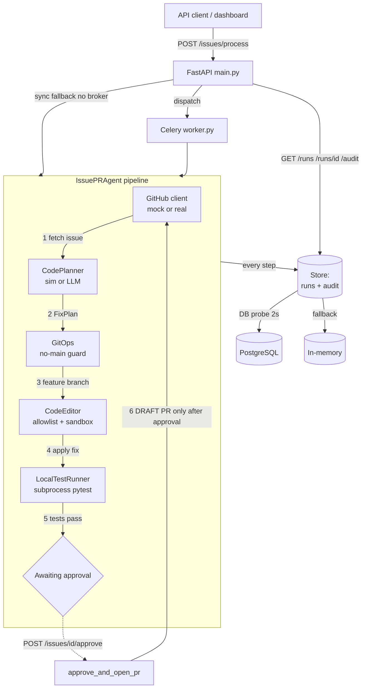

# github-issue-pr-agent


> An autonomous agent that reads a GitHub issue, plans a fix, edits code in a sandbox under strict safety guards, runs the test suite, and — only after human approval — opens a **draft** pull request.

## Why

Coding agents are powerful and dangerous in the same breath: the moment you give one write access to a repository, a hallucinated edit, a path-traversal slip, or an over-eager merge can do real damage. This project demonstrates how to wrap an LLM-driven code-fixing loop in **defense-in-depth safety boundaries** so the autonomy is bounded, auditable, and reversible:

- it edits **only allowlisted paths** in a **disposable sandbox** copy of the repo,
- it **never commits to or pushes** `main`/`master`, and **never merges**,
- it **proves the fix with a real test run** before proposing anything,
- it **opens nothing without explicit approval** — a human gates every PR,
- and **every action is written to an append-only audit trail**.

## What it demonstrates

- **Offline-first, real-when-keyed.** Runs end to end with **no API keys, no database, and no broker** using deterministic mocks/sims. Flip `GITHUB_MODE=real` + a token to hit the real GitHub REST API, and set `OPENAI_API_KEY`/`ANTHROPIC_API_KEY` to plan with a real LLM — both via `shared_core`.
- **A real safety model**, not a toy: allowlist/blocklist globs, sandbox containment (traversal + symlink escape blocked), a no-main git guard, and an approval gate.
- **A real test-verification loop**: the agent runs `pytest` in a subprocess against the sandbox and refuses to proceed if tests fail.
- **Durable, queryable state**: runs and the audit trail persist to PostgreSQL when available, with a transparent in-memory fallback so tests and the demo need no DB.
- **A working before/after walkthrough** on a bundled `demo_repo` (a deliberately buggy `calculator.py` + a failing test that the agent's fix makes pass).

## Architecture



The pipeline stops at `awaiting_approval` after a successful test run. **No PR is opened** until `POST /issues/{id}/approve` (or `AUTO_APPROVE=true`) is called — that is the single code path that creates a pull request, and it always creates it as a **draft**.

### Run lifecycle

```
pending → planned → awaiting_approval → approved → completed
                              │
                              └── (tests fail) → failed
```

## Tech stack

| Concern | Choice |
|---|---|
| API | FastAPI + Uvicorn |
| Async tasks | Celery (via `shared_core.tasks.create_celery_app`) |
| Persistence | SQLAlchemy + PostgreSQL, Alembic migrations, in-memory fallback |
| LLM planning | `shared_core.llm.LLMClientFactory` (OpenAI/Anthropic), simulated by default |
| GitHub | `shared_core.clients.BaseHTTPClient` against the REST API; deterministic mock by default |
| Git ops | local `git` via `subprocess` |
| Test verification | `pytest` in a subprocess |
| Config / logging / errors / health | `shared_core` (`BaseAppConfig`, `setup_logging`, `application_error_handler`, `check_health`) |

## Setup

```bash
# 1. Create a virtualenv and install shared-core + this project
python -m venv .venv
.venv/Scripts/python -m pip install -e "../shared-core[dev,docparse]" numpy
.venv/Scripts/python -m pip install -e ".[dev]" celery alembic

# 2. (optional) copy env and customise
cp .env.example .env
```

Everything works with the defaults — **no `.env`, no database, no keys required.**

### Going real (optional)

| Env var | Effect |
|---|---|
| `GITHUB_MODE=real` + `GITHUB_TOKEN=...` | Read issues / create branches / open draft PRs against real GitHub |
| `OPENAI_API_KEY=...` or `ANTHROPIC_API_KEY=...` | Plan fixes with a real LLM instead of the simulator |
| `DATABASE_URL=postgresql+psycopg://...` | Persist runs + audit to PostgreSQL (probed on startup) |
| `CELERY_BROKER_URL=redis://...` | Dispatch `/issues/process` asynchronously to a worker |
| `AUTO_APPROVE=true` | Skip the human gate (open the draft PR automatically once tests pass) |

## Demo

```bash
.venv/Scripts/python examples/run_demo.py
```

This provisions a disposable copy of `demo_repo`, shows the **before** state (tests fail on the division-by-zero bug), runs the agent pipeline for issue #101, shows the **after** state (tests pass), approves the run to open a draft PR, and prints the full audit trail. Exits `0`.

Run the API instead:

```bash
.venv/Scripts/python -m issue_pr_agent.main      # serves on :8000
```

Then drive it:

```bash
# submit (runs synchronously when no broker is configured)
curl -X POST localhost:8000/issues/process -H 'content-type: application/json' \
     -d '{"issue_id":101,"repo":"octocat/demo","sync":true}'

# inspect
curl localhost:8000/runs
curl localhost:8000/audit

# approve -> opens the draft PR
curl -X POST localhost:8000/issues/101/approve
```

### Endpoints

| Method | Path | Purpose |
|---|---|---|
| `POST` | `/issues/process` | Submit an issue (async via Celery, or `sync=true`/no-broker fallback) |
| `POST` | `/issues/{id}/approve` | Approve a run awaiting approval and open a **draft** PR |
| `GET` | `/runs` | List recent runs |
| `GET` | `/runs/{id}` | Single run detail (plan, files changed, test outcome, PR URL) |
| `GET` | `/audit` | Append-only audit trail (filterable by `run_id`) |
| `GET` | `/health` | Service + dependency health |

## Tests

```bash
.venv/Scripts/python -m pytest -q
```

Coverage spans every core module (planner, editor, git ops, test runner, store, sandbox, GitHub client, db probe), the end-to-end pipeline on `demo_repo`, every API endpoint (success + error), the Celery task (no broker), the safety guards (allowlist / blocklist / traversal / no-main / approval gate), and golden cases for the deterministic planner output. Nothing requires the network, a database, or API keys.

> Note: several tests spawn a real `pytest` subprocess against the sandbox, so the full suite takes a few minutes.

## Known limitations

- **The "fix" is a fixed strategy, not free-form codegen.** The agent applies a deterministic `FixStrategy` (search/replace) so the offline demo is repeatable and auditable. The planner produces a real (sim or LLM) plan, but applying arbitrary model-generated patches is intentionally out of scope here — see the roadmap.
- **No Docker/network isolation of the sandbox yet.** Edits happen in a temp-dir copy with path containment, but test execution runs on the host. A network-isolated container sandbox is the next hardening step.
- **Single-file fixes.** The current strategy and target-file inference handle one file per run.
- **Real GitHub paths are wired but exercised via mocks in CI** (no live token in the offline test suite).

## Roadmap

1. **Patch application from the LLM plan** — let the model propose edits, validated against the same safety gate before they touch disk.
2. **Containerized sandbox** — run edit + test inside an ephemeral, network-isolated container.
3. **Multi-file refactors** — plan and edit across several files with dependency awareness.
4. **Webhook trigger** — process issues automatically on a label, with rate limiting.
5. **Self-correction loop** — on a failing test run, re-plan and retry within a bounded budget.

See [`docs/`](docs/) for the architecture, design decisions, failure modes, security model, and the execution plan.
