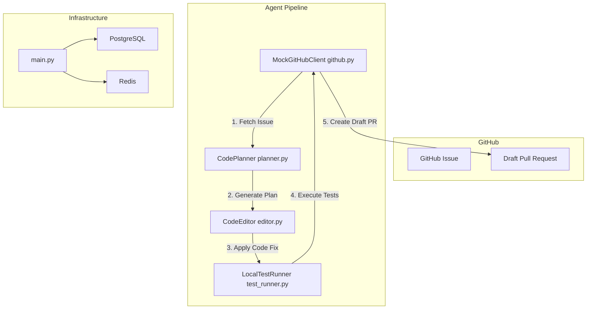
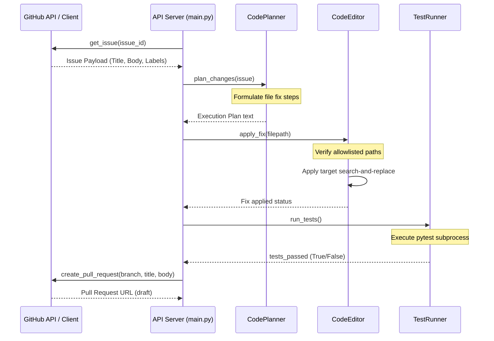

# Architectural Design - GitHub Issue-to-PR Agent

This document outlines the architectural design, dataflow, and component interactions of the GitHub Issue-to-PR Agent.

---

## 1. System Overview

The GitHub Issue-to-PR Agent is an autonomous development bot designed to ingest GitHub issues, formulate code modifications, apply code patches locally, run regression test suites, and open draft pull requests. 

The architecture is built on a step-by-step pipeline ensuring security gates (like path allowlists) are checked before any code edit occurs.

---

## 2. Ingestion & Execution Workflow

---

## 3. Detailed Dataflow Sequence

---

## 4. Module Breakdown

### 4.1 GitHub Client (`github.py`)
- **`MockGitHubClient`**: Simulates communication with the GitHub API. In production, this utilizes PyGithub or standard requests to fetch issue details and submit pull requests.

### 4.2 Code Planner (`planner.py`)
- **`CodePlanner`**: Analyzes the issue content (such as bug descriptions) and generates a step-by-step text instruction mapping which files need modification and how to apply the fix.

### 4.3 Code Editor (`editor.py`)
- **`CodeEditor`**: Handles files edits. It implements search-and-replace algorithms to apply patches. It must validate that target filepaths fall within strict safety directories.

### 4.4 Local Test Runner (`test_runner.py`)
- **`LocalTestRunner`**: Spawns local test environments (e.g. executing `pytest` via `subprocess`) and parses the terminal exit codes and console logs to verify that the code edits did not break the build.
