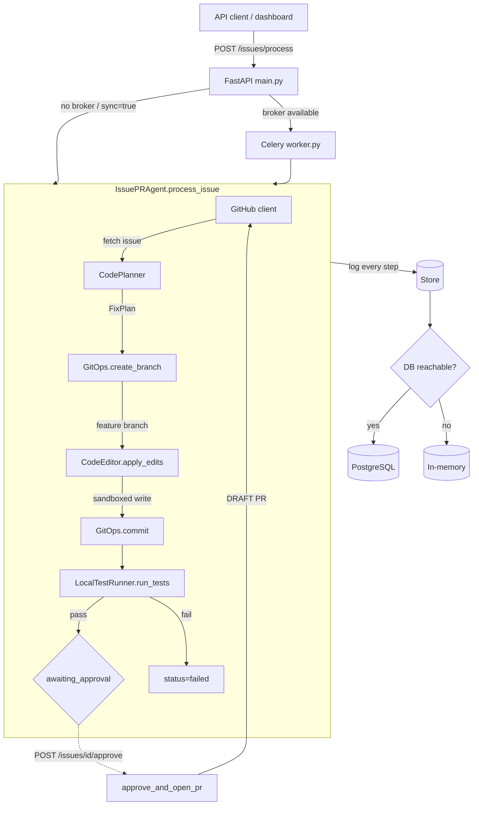
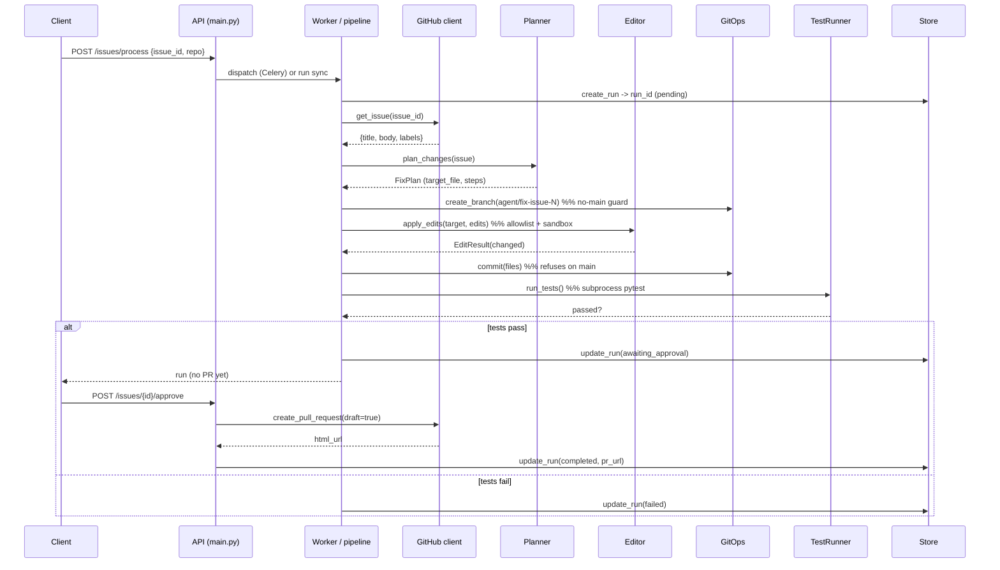

# Architecture — github-issue-pr-agent

This document describes the components, data flow, persistence model, and the
offline-first / real-when-keyed strategy of the agent.

---

## 1. System overview

The agent turns a GitHub issue into a **draft** pull request through a fixed,
auditable pipeline. Each stage has a single responsibility and a corresponding
safety boundary; no stage can be skipped, and no pull request can be created
without passing every prior stage and a human approval gate.

---

## 2. Components

| Module | Class / fn | Responsibility | Safety boundary |
|---|---|---|---|
| `github.py` | `MockGitHubClient` / `RealGitHubClient`, `build_github_client` | Read issues, create branches, open draft PRs | Draft-only PRs; mock by default |
| `planner.py` | `CodePlanner`, `FixPlan` | Produce a structured fix plan (sim or LLM) | Issue text treated as untrusted; no tool access |
| `agent.py` | `IssuePRAgent`, `FixStrategy` | Orchestrate the pipeline + approval gate | Enforces ordering; PR only after approval |
| `editor.py` | `CodeEditor`, `Edit` | Apply search/replace edits | Allowlist + blocklist + sandbox containment |
| `git_ops.py` | `GitOps`, `GitResult` | Branch / commit / (refuse push+merge) | No-main guard; never push protected; never merge |
| `test_runner.py` | `LocalTestRunner` | Run pytest in a subprocess | `shell=False`, arg list, timeout |
| `sandbox.py` | `provision_sandbox` | Disposable repo copy | Pristine repo never edited in place |
| `store.py` | `InMemoryStore` / `DatabaseStore` | Persist runs + audit | Append-only audit |
| `db.py` | `check_db`, `build_store` | DB availability probe + backend select | 2s connect timeout, graceful fallback |
| `models.py` | `AgentRun`, `AuditEntry` | SQLAlchemy schema | — |
| `worker.py` | `process_issue_task`, `run_issue_pipeline` | Celery task wrapping the pipeline | Importable with no broker |
| `main.py` | FastAPI app | HTTP surface | Typed errors, request logging |

---

## 3. Data flow (sequence)

---

## 4. Persistence model

Two tables, created automatically via `DatabaseManager.create_tables()` when a
database is reachable (and also managed by Alembic for production):

- **`agent_runs`** — one row per run: lifecycle `status`, the generated `plan`,
  `branch`, `files_changed` (JSON), `tests_passed`, `approved`, `pr_url`, `error`.
- **`audit_entries`** — append-only, foreign-keyed to a run: `action`, `actor`,
  `details` (JSON), timestamp.

`InMemoryStore` and `DatabaseStore` implement the **same interface** (`create_run`,
`update_run`, `get_run`, `list_runs`, `log_action`, `get_audit`) so the API, worker,
and demo are agnostic to the backend. `db.check_db()` probes connectivity with a 2s
connect timeout on startup; on any failure it logs a warning and the service uses
the in-memory store.

---

## 5. Offline-first / real-when-keyed

Every external dependency has a deterministic default and a real path behind a
config flag or key:

| Dependency | Offline default | Real path |
|---|---|---|
| GitHub | `MockGitHubClient` (deterministic issues, synthetic PR URL) | `RealGitHubClient` via `BaseHTTPClient` when `GITHUB_MODE=real` + token |
| LLM plan | `CodePlanner` simulator (deterministic `FixPlan`) | `LLMClientFactory` (OpenAI/Anthropic) when a key is set |
| Database | `InMemoryStore` | `DatabaseStore` when `DATABASE_URL` is reachable |
| Task queue | synchronous in-process | Celery dispatch when a broker is reachable |

This mirrors the `mocked_response` short-circuit pattern used across the showcase
(`llm-cost-latency-monitor/sdk.py`): a mock/sim hint is honored first, otherwise the
real provider is attempted with a graceful fallback to simulation on `ImportError`
or missing key.

---

## 6. Why a fixed `FixStrategy`

Applying arbitrary LLM-generated patches to a repo is the genuinely risky part of
a coding agent. To keep the showcase deterministic, repeatable, and safe, the agent
applies an explicit `FixStrategy` (search/replace `Edit`s) that still flows through
the **same** safety gate (`CodeEditor.check_path`) any real patch would. The planner
produces a real plan; wiring the plan's output into validated edits is the first
roadmap item. This separation lets the safety model be exercised and tested today
without trusting model output to touch disk.
